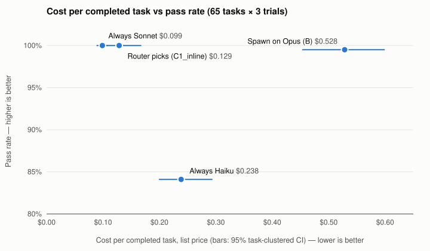

# Cheapest per token is not cheapest per task: a pre-registered test of model routing for agent handoffs

> Generated by `model-routing dispatch-paper` from `20260924-125257`, then the prose was filled in by hand. Tables are computed; regenerating the draft overwrites this prose.
>
> **Analysis status: CONFIRMATORY.**

## Abstract

We ran 65 tasks x 3 trial(s) under 4 dispatch policies (780 graded cells, $202.3332 list-price spend including setup).
Primary comparison (H-D1, C1_inline vs B): cost per completed task changed by -76% (saving 76%, 95% CI 70% to 80%, p_saving = <0.001); pass rate changed by +0.5 pts (95% CI +0.0 to +1.5, non-inferiority margin 10 pts, p_noninf = <0.001). Verdict: **supported** (confirmatory).

Model routing promises savings by sending easy work to cheaper models, but price lists compare tokens, and what an organisation pays for is completed work. We measured cost per completed task, the price of every call including the routing decision, for 65 agentic coding tasks handed off from a frontier-model session, three trials each, under a pre-registered analysis plan. Letting the parent session name the worker model while it writes the handoff brief cut cost per completed task by 76% against spawning every handoff on the parent's own model (Opus), with no loss in completion (100% vs 99%); the saving is still 50% when the router's whole turn is billed. But a fixed default did as well or better: spawning every handoff on the mid-tier model (Sonnet) completed 100% of tasks at $0.099 per task, 23% below the router, while the cheapest model (Haiku) completed 84% at $0.24, 2.4 times Sonnet's cost, because it failed more often and worked longer. On this task set the saving comes from not defaulting to the most expensive model, not from picking a model per task.

## 1. Background and question

> When an assistant session hands work off to a fresh agent session (a task chip, a subagent), does letting the parent pick the worker model reduce the cost per completed task without a meaningful drop in the completion rate?

Primary hypothesis, quoted from `docs/experiments/dispatch-routing.md`:

> **Primary hypothesis (H-D1).** Spawning with the model the parent recommends *while it writes the brief* (policy `C1_inline`) has a lower cost per completed task than spawning with the parent's own model (policy `B`), with a pass rate no more than the non-inferiority margin (10 points) worse.

Non-inferiority margin used by this analysis: **10 percentage points** (`margin_pp` in `meta.json`). Primary comparison: `C1_inline` (treatment) vs `B` (control).

Most routing work classifies single prompts and compares per-token prices (for example learned routers that send a query to a strong or a weak model). Agentic work breaks both assumptions: a task is many calls whose count depends on the model, a weaker model can cost more per task by taking more turns, and prompt caches are per model, so switching models mid-session discards cached context. The handoff, when a session spawns a fresh agent with a written brief (a task chip, a subagent), is the natural place to choose a model. The new session starts with an empty cache whatever model it runs on, the parent has just read the relevant context, and the brief it writes is the whole input the worker will see. That makes the choice cheap to make (the parent is writing the brief anyway) and cheap to change.

## 2. Methods

### 2.1 Design

Paired design: every sampled task runs under every selected policy for the same number of trials (3). Ordering: `order = "randomized"`, seed `20260923` (a seeded randomized block per (task, trial) when randomized); sessions run strictly sequentially. Turn cap: 40 per session for every policy. Parent model: `opus`; router menu: `haiku`, `sonnet`, `opus_low`, `opus`.

### 2.2 Policies run

| policy | kind | parameters | cells |
|---|---|---|---:|
| `B` | `spawn_static` | candidate=opus | 195 |
| `C1_inline` | `spawn_parent_pick_inline` | - | 195 |
| `static_haiku` | `spawn_static` | candidate=haiku | 195 |
| `static_sonnet` | `spawn_static` | candidate=sonnet | 195 |

### 2.3 Task set

65 distinct tasks. Difficulty labels as stored with the task set at run time measured by the calibration run `exp05_calibrate/20260923-135345` (66 tasks on Haiku, Sonnet and Opus, two trials each, $109.60): "easy" means Haiku passed every calibration trial, "medium" that it passed some but not all. No task was passed only by Opus. One task that no model passed was excluded as a gotcha before registration.

| difficulty | tasks | histogram |
|---|---:|---|
| easy | 50 | ################################################## |
| medium | 15 | ############### |

Categories: bugfix (29), config (5), docs (3), feature (13), migration (4), perf (5), refactor (3), tests (3).
Fixture repos: `invoicing` (21 tasks), `logproc` (22 tasks), `notes` (22 tasks).

Grading is deterministic: a cell passes when the hidden tests pass, the visible tests still pass, and no file outside the task's allowed paths changed. No LLM judge.

### 2.4 Pre-registration and provenance

- `20260924-125257`: **confirmatory**

| run | taskset_sha256 | config_sha256 | git_sha | CLI versions | started |
|---|---|---|---|---|---|
| `20260924-125257` | `5b99585211dedaaf` | `261b1cc76a9dd412` | `aa0d54cd17fd` | claude_cli 2.1.278 (Claude Code); codex_cli codex-cli 0.154.0 | 2026-09-24T16:52:57.965145+00:00 |

Full hashes are in section 6.

### 2.5 Models actually resolved

Per candidate, the model id each session reported (from `sessions.jsonl`), so alias drift is visible:

| candidate | configured | resolved model ids (sessions) | roles |
|---|---|---|---|
| `haiku` | claude_cli:haiku | `claude-haiku-4-5` x214 | worker 214 |
| `opus` | claude_cli:opus | `claude-opus-5` x593 | router 195, setup 196, worker 202 |
| `sonnet` | claude_cli:sonnet | `claude-sonnet-5` x364 | worker 364 |

### 2.6 Pricing and billing

Every session is priced at list price from `src/model_routing/data/pricing.toml` (uncached input, cache read, cache write, output). Setup sessions that seed a parent context are a sunk cost: reported, excluded from the headline. Router calls are billed to the task. `C1_inline` bills only the pick's marginal tokens (chars/4); section 4.1 re-bills its whole brief-writing turn.
1171 of 1171 sessions carried a CLI-reported cost for cross-checking.

### 2.7 Intention to treat and errors

Every planned (task, policy, trial) cell counts once. Session errors are graded on whatever state the sandbox is in, and their cost counts. Usage limits and provider outages are the exception: the run pauses and the cell is redone (pre-registration deviation 1). In this run every error was a Haiku session hitting the 40-turn cap.

| policy | cells | cells with errors | error rate |
|---|---:|---:|---:|
| B | 195 | 0 | 0.0% |
| C1_inline | 195 | 0 | 0.0% |
| static_haiku | 195 | 36 | 18.5% |
| static_sonnet | 195 | 0 | 0.0% |

Sessions ending in a provider error: 36 of 1171.

## 3. Results

**C1_inline vs B: cut cost per completed task by 76% (95% CI 70% to 80%) and changed pass rate by +1 pts (95% CI +0 to +2); non-inferior within 10 pts and a real saving → supported.**

### 3.1 Policies

| policy | n | pass rate (95% CI) | cost/task | cost/completed task (95% CI) | router share | escalations/cell | error rate | mean turns |
|---|---:|---:|---:|---:|---:|---:|---:|---:|
| B | 195 | 99% (98-100%) | $0.5257 | $0.5284 ($0.4539-$0.5987) | 0% | 0.00 | 0.0% | 14.6 |
| C1_inline | 195 | 100% (100-100%) | $0.1286 | $0.1286 ($0.1036-$0.1671) | 2% | 0.00 | 0.0% | 9.3 |
| static_haiku | 195 | 84% (76-91%) | $0.2006 | $0.2385 ($0.2000-$0.2931) | 0% | 0.00 | 18.5% | 26.3 |
| static_sonnet | 195 | 100% (100-100%) | $0.0989 | $0.0989 ($0.0895-$0.1086) | 0% | 0.00 | 0.0% | 7.4 |

Intervals: 95% task-clustered bootstrap (trials of a task resampled together).

### 3.2 Comparisons

| id | role | comparison | n paired | saving (95% CI) | p_saving | p_adj | delta pass pts (95% CI) | p_pass | p_noninf | verdict |
|---|---|---|---:|---:|---:|---:|---:|---:|---:|---|
| H-D1 | primary | C1_inline vs B | 195 | 76% (70 to 80) | <0.001 | - | +0.5 (+0.0 to +1.5) | 1.000 | <0.001 | supported |
| H-D7 | secondary (exploratory) | oracle vs B | 195 | 82% (80 to 83) | <0.001 | <0.001 | +0.5 (+0.0 to +1.5) | 1.000 | <0.001 | supported |
| H-D1-medium | pre-specified subgroup (measured medium) | C1_inline vs B | 45 | 80% (75 to 84) | <0.001 | - | +2.2 (+0.0 to +6.7) | 1.000 | <0.001 | supported |

p_saving / p_pass: two-sided task-clustered permutation tests; p_noninf: one-sided bootstrap p for 'worse by at least the margin'; p_adj: Holm-adjusted p_saving across the secondary (exploratory) hypotheses. Only H-D1 is confirmatory.

Power: Primary comparison needs about 5 paired task-trials to resolve a 10-pt margin at 95%/80% power (observed discordance 1%); this run has 195 across 65 distinct tasks - enough. Repeated trials of one task help less than new tasks because they are clustered. Treat 'inconclusive' at small n as expected, not as a null result.

**H-D1 (primary, confirmatory).** Letting the parent name the worker model while it writes the brief cost a quarter of what spawning on the parent's own model cost, per completed task, and completed as many tasks: the saving interval (70% to 80%) and the pass-rate interval (+0 to +2 points) both clear the pre-registered test by a wide margin. **H-D7 (exploratory).** Picking the cheapest passing model in hindsight would save 82%; the router recovered 93% of that. **H-D1-medium (pre-specified subgroup).** On the 15 tasks where Haiku sometimes fails, the router kept a 100% pass rate and saved 80%; it never picked Haiku there.

**Not pre-registered, reported because a reader will ask.** Against a fixed "always Sonnet" default the router was 30% *more* expensive per completed task (task-clustered 95% CI +9% to +59%), at the same 100% completion. Every departure from Sonnet raised cost: its 7 Opus picks averaged $0.85 per task, and its 19 Haiku picks cost $0.062 against Sonnet's $0.055 on the same cells. Always Haiku was 2.4 times the cost of always Sonnet per completed task (CI 2.1 to 2.8 times): it failed 16% of cells, and its sessions averaged 26 turns to Sonnet's 7.

### 3.3 Pass rate by measured difficulty

| difficulty | B | C1_inline | static_haiku | static_sonnet |
|---|---:|---:|---:|---:|
| easy | 150/150 (100%) | 150/150 (100%) | 143/150 (95%) | 150/150 (100%) |
| medium | 44/45 (98%) | 45/45 (100%) | 21/45 (47%) | 45/45 (100%) |

### 3.4 Pass rate by task category

| category | B | C1_inline | static_haiku | static_sonnet |
|---|---:|---:|---:|---:|
| bugfix | 86/87 (99%) | 87/87 (100%) | 66/87 (76%) | 87/87 (100%) |
| config | 15/15 (100%) | 15/15 (100%) | 14/15 (93%) | 15/15 (100%) |
| docs | 9/9 (100%) | 9/9 (100%) | 9/9 (100%) | 9/9 (100%) |
| feature | 39/39 (100%) | 39/39 (100%) | 39/39 (100%) | 39/39 (100%) |
| migration | 12/12 (100%) | 12/12 (100%) | 8/12 (67%) | 12/12 (100%) |
| perf | 15/15 (100%) | 15/15 (100%) | 10/15 (67%) | 15/15 (100%) |
| refactor | 9/9 (100%) | 9/9 (100%) | 9/9 (100%) | 9/9 (100%) |
| tests | 9/9 (100%) | 9/9 (100%) | 9/9 (100%) | 9/9 (100%) |

### 3.5 Router overhead

| policy | router cost/cell | router share (as billed) | router share (full turn) |
|---|---:|---:|---:|
| C1_inline | $0.0024 | 2% | 52% |

The full-turn column bills the whole recorded router turn (`cost_usd_full`); it only differs for policies that bill marginal pick tokens (`C1_inline`).

### 3.6 Oracle bound

The oracle takes, per (task, trial), the cheapest `static_*` policy that passed (computed in hindsight, not deployable): pass rate 100%, cost per completed task $0.0976. Oracle vs `B`: saving 82% (95% CI 80% to 83%). `C1_inline` recovers 93% of the oracle's saving (point estimates).

### 3.7 Model mix chosen by routing policies

| policy | kind | final model: share of cells (passes) |
|---|---|---|
| C1_inline | `spawn_parent_pick_inline` | haiku 10% (19/19 passed), opus 4% (7/7 passed), sonnet 87% (169/169 passed) |

For cascades the final model is the last one escalated to. The pick is the router's parsed choice only; router text is not reproduced.

### 3.8 Cost vs pass rate (Pareto view)

| policy | cost/completed task | pass rate | cost/task | Pareto-efficient |
|---|---:|---:|---:|---|
| oracle (computed) | $0.0976 | 100% | $0.0976 | not deployable (oracle) |
| static_sonnet | $0.0989 | 100% | $0.0989 | yes |
| C1_inline | $0.1286 | 100% | $0.1286 | dominated |
| static_haiku | $0.2385 | 84% | $0.2006 | dominated |
| B | $0.5284 | 99% | $0.5257 | dominated |

Sorted by cost per completed task. Oracle and hidden-test cascades are upper bounds and excluded from the frontier. A policy is dominated when another deployable policy has at least its pass rate at no more cost (strictly better on one).



## 4. Robustness

### 4.1 Pessimistic router billing

| billing | C1_inline vs B saving | 95% CI | p_saving | verdict |
|---|---:|---:|---:|---|
| as billed (marginal pick tokens) | 75.7% | 70% to 80% | <0.001 | supported |
| pessimistic (whole router turn, `cost_usd_full`) | 50.2% | 43% to 55% | <0.001 | supported |

Pass rates are unchanged by billing; only cost moves. The as-billed row is what a real spawner pays when the pick rides on a turn the parent takes anyway to write the brief: the extra cost is the menu and one JSON line. The pessimistic row bills the entire brief-writing turn to routing, which overstates it, since `B` needs a brief too; it is the upper bound for a design where routing is a separate call. Even then routing saves half. Against "always Sonnet" the pessimistic bill makes the router 2.7 times as expensive (CI 2.4 to 3.0).

### 4.2 Excluding errored cells

| analysis | n paired | saving | delta pass pts |
|---|---:|---:|---:|
| intention to treat (all cells) | 195 | 75.7% | +0.5 |
| errored cells excluded | 195 | 75.7% | +0.5 |

36 errored cell(s) excluded (paired cells drop from both arms). Point estimates only; the confirmatory analysis is intention to treat. Every errored cell is a Haiku session that hit the 40-turn cap, so neither arm of H-D1 had any, and excluding them leaves the primary result unchanged. No usage limit or provider outage occurred during the run. Under deviation 1 such cells would have been redone, not graded.

## 5. Threats to validity

- [ ] **Clock-time / provider drift.** Control: seeded randomized block order per (task, trial); sequential sessions. This run: order = randomized. The run spanned about 16 hours of clock time, including one planned stop and resume at 336 of 780 cells to raise the budget. Randomized blocks spread any drift across policies, so it adds noise, not bias.
- [ ] **Model alias drift.** Control: resolved model id per session; CLI versions and git SHA in meta.json. This run: 1171/1171 sessions report a resolved id (section 2.5), with one resolved id per alias for the whole run. The results describe `claude-haiku-4-5`, `claude-sonnet-5` and `claude-opus-5` as served on 2026-09-24/25. Aliases move, so a rerun may measure different models.
- [ ] **Task-set or config edits after registration.** Control: taskset_sha256 and config_sha256 checked against [preregistration]. This run: no registered field changed. One harness rule changed mid-run, before any analysis (deviation 1 in the pre-registration: provider outages are redone, not graded). No outage occurred, so no cell was affected.
- [ ] **Guessed difficulty labels.** Control: labels measured by a calibration run (dispatch-calibration). This run: `exp05_calibrate/20260923-135345`, two trials per model rather than the planned three (budget; recorded in the pre-registration). Labels only stratify the subgroup and the tables; no policy sees them.
- [ ] **Brief-quality confound in routing.** Control: C1_inline's worker gets the same canned brief as B. This run: C1_inline ran. The comparison isolates the model choice. It does not measure whether a parent writes a better or worse brief when it also has to pick a model.
- [ ] **Router overhead overstated (or understated).** Control: C1_inline bills marginal pick tokens; C1 keeps the full router call. This run: both billings in section 4.1. The forked router `C1` (a separate call that re-reads the parent context) was not run in stage 1, so the cost of routing as a separate call is bounded by 4.1, not measured.
- [ ] **Selective reporting.** Control: metric, margin, trials, ordering, policies fixed before the run; Holm for secondaries. This run: run is confirmatory. The comparison against "always Sonnet", which carries the paper's main practical point, was not pre-registered. It is reported with intervals and labelled exploratory.
- [ ] **Silent failures.** Control: session errors graded as-is and counted (intention to treat); usage limits and provider outages pause the run and the cell is redone (deviation 1). This run: 36 errored cell(s), all Haiku turn caps; see sections 2.7 and 4.2. No limits or outages.
- [ ] **External validity of synthetic tasks.** Control: fixture repos written for the study, not harvested production work. This run: three small Python fixture repositories, with tasks written to resemble the handoffs harvested from real sessions (bug fixes, features, migrations, config), and hidden tests that check the stated requirements. The tasks are short and well specified, and the hardest defeated only Haiku. Harder, vaguer or longer work may give routing more headroom (a task only Opus can do) or less (Sonnet may start to fail too). The results speak to agentic coding handoffs. They do not speak to chat-style knowledge work.
- [ ] **chars/4 token approximation.** Control: C1_inline's marginal router tokens are estimated as characters / 4. This run: the marginal pick averaged $0.0024 per cell, 2% of C1_inline's cost. Even a 2x error in the estimate moves the saving by about 2 points, and 4.1 gives the bound that does not depend on it.
- [ ] **Subscription vs API billing.** Control: runs use the operator's subscription login; costs are list API prices. This run: every figure is list API price, which is what an API-key user pays. A subscription user pays a flat fee and spends a usage allowance instead of dollars. Relative costs should carry over to how fast that allowance runs out, but that mapping was not measured here.
- [ ] **Single vendor.** Control: one model family per track; the codex track is a separate replication. This run: providers in this run: claude_cli. One vendor's models, prices and agent harness. Price ratios between tiers differ across vendors, so the Sonnet-vs-router gap in particular may not carry over.

## 6. Reproducibility

### `20260924-125257`

```bash
git checkout aa0d54cd17fdbce822c42217cb92cc72c814c905
make setup
uv run model-routing dispatch-estimate experiments/agentic/exp05_dispatch.toml
uv run model-routing dispatch-run \
  experiments/agentic/exp05_dispatch.toml \
  --budget-usd 230.0 \
  --trials 3 \
  --policies B,C1_inline,static_haiku,static_sonnet
```

- taskset_sha256: `5b99585211dedaaf8271bf9520d9de8ff2d240cd5e802a0c7c43026847634804`
- config_sha256: `261b1cc76a9dd4120d11825781b94edce9a4d28debd23c023c2971f5e5756186` (the config as run is archived as `config.toml` in the run directory)
- git_sha: `aa0d54cd17fdbce822c42217cb92cc72c814c905`; harness 0.1.0; Python 3.14.7; macOS-26.6.2-arm64-arm-64bit-Mach-O
- CLI versions: claude_cli 2.1.278 (Claude Code); codex_cli codex-cli 0.154.0
- seed 20260923, order randomized, max_turns 40, started 2026-09-24T16:52:57.965145+00:00

Rebuild the statistics and this draft:

```bash
make dispatch-report RUN=<run_dir>
make dispatch-paper RUNS="<20260924-125257>" OUT=<draft.md>
```

## Appendix A. Per-task pass/fail matrix

One mark per trial, in trial order: P = passed, F = failed, ! = the cell had a provider error (graded as-is).

| task | difficulty | B | C1_inline | static_haiku | static_sonnet |
|---|---|---|---|---|---|
| inv-badge-01 | easy | P P P | P P P | P P P | P P P |
| inv-cache-02 | easy | P P P | P P P | P P P | P P P |
| inv-config-01 | easy | P P P | P P P | P P P | P P P |
| inv-csv-01 | easy | P P P | P P P | P P P | P P P |
| inv-currency-02 | easy | P P P | P P P | F! P P | P P P |
| inv-customers-02 | medium | P P P | P P P | P P P | P P P |
| inv-dates-01 | easy | P P P | P P P | P P P | P P P |
| inv-discount-02 | easy | P P P | P P P | F! P P | P P P |
| inv-dryrun-01 | easy | P P P | P P P | P P P | P P P |
| inv-fix-01 | easy | P P P | P P P | P P P | P P P |
| inv-fxrates-03 | medium | P P P | P P P | F F P! | P P P |
| inv-ledger-03 | easy | P P P | P P P | F F P | P P P |
| inv-numbering-02 | medium | P P P | P P P | P! F! P | P P P |
| inv-page-01 | easy | P P P | P P P | P P P | P P P |
| inv-race-01 | easy | P P P | P P P | P P P | P P P |
| inv-retry-01 | easy | P P P | P P P | P P P | P P P |
| inv-rfc3339-02 | easy | P P P | P P P | P P P | P P P |
| inv-rfref-03 | medium | P P P | P P P | P F F! | P P P |
| inv-rounding-02 | easy | P P P | P P P | P P! P | P P P |
| inv-status-02 | easy | P P P | P P P | P P P | P P P |
| inv-test-01 | easy | P P P | P P P | P P P | P P P |
| log-badge-01 | easy | P P P | P P P | P P P | P P P |
| log-batch-02 | easy | P P P | P P P | P P P | P P P |
| log-config-01 | easy | P P P | P P P | P P P | P P P |
| log-config-02 | medium | P P P | P P P | P! F! P | P P P |
| log-csv-01 | easy | P P P | P P P | P P P | P P P |
| log-dates-01 | easy | P P P | P P P | P P P | P P P |
| log-dryrun-01 | easy | P P P | P P P | P P P | P P P |
| log-fix-01 | easy | P P P | P P P | P P P | P P P |
| log-follow-03 | easy | P P P | P P P | P P! P! | P P P |
| log-index-02 | easy | P P P | P P P | P P P | P P P |
| log-latency-03 | medium | P P P | P P P | F! P! F | P P P |
| log-levels-02 | medium | P P P | P P P | F! P! P | P P P |
| log-multiline-02 | easy | P P P | P P P | P P P | P P P |
| log-page-01 | easy | P P P | P P P | P P P | P P P |
| log-pager-03 | easy | P P P | P P P | P P P | P P P |
| log-race-01 | easy | P P P | P P P | P P P | P P P |
| log-redact-03 | easy | P P P | P P P | P P! P! | P P P |
| log-retry-01 | easy | P P P | P P P | P P P | P P P |
| log-source-02 | medium | P P P | P P P | F P! F | P P P |
| log-test-01 | easy | P P P | P P P | P P P | P P P |
| log-tz-02 | medium | P P F | P P P | F F! F! | P P P |
| log-writer-02 | medium | P P P | P P P | F F F | P P P |
| notes-archive-02 | medium | P P P | P P P | F F F | P P P |
| notes-badge-01 | easy | P P P | P P P | P P P | P P P |
| notes-bulkimport-03 | easy | P P P | P P P | P P! F! | P P P |
| notes-config-01 | easy | P P P | P P P | P P P | P P P |
| notes-csv-01 | easy | P P P | P P P | P P P | P P P |
| notes-dates-01 | easy | P P P | P P P | P P P | P P P |
| notes-dryrun-01 | easy | P P P | P P P | P P P | P P P |
| notes-duefmt-02 | easy | P P P | P P P | P! P! P! | P P P |
| notes-fix-01 | easy | P P P | P P P | P P P | P P P |
| notes-ics-03 | medium | P P P | P P P | F F F! | P P P |
| notes-ids-02 | medium | P P P | P P P | P P! P | P P P |
| notes-links-02 | easy | P P P | P P P | P F! F | P P P |
| notes-page-01 | easy | P P P | P P P | P P P | P P P |
| notes-priority-02 | medium | P P P | P P P | P! P! P! | P P P |
| notes-race-01 | easy | P P P | P P P | P P P | P P P |
| notes-rc-02 | easy | P P P | P P P | P P P | P P P |
| notes-recur-03 | medium | P P P | P P P | P P! F! | P P P |
| notes-retry-01 | easy | P P P | P P P | P P P | P P P |
| notes-stats-02 | easy | P P P | P P P | P! P P! | P P P |
| notes-syncstate-02 | easy | P P P | P P P | P P P | P P P |
| notes-test-01 | easy | P P P | P P P | P P P | P P P |
| notes-today-03 | easy | P P P | P P P | P! P P | P P P |
